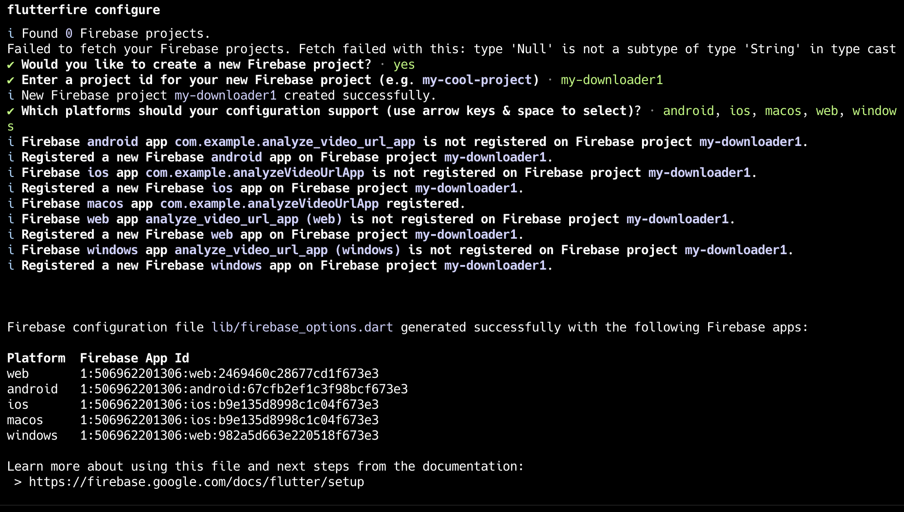

# analyze_video_url_app

A new Flutter project.


```shell
flutter gen-l10n

flutter run -d emulator-5554
```


```
gradle.beforeProject { project ->
    project.plugins.withId('com.android.library') { 
        if (project.name == "image_gallery_saver") {
            project.android.namespace = "com.example.imagegallerysaver"
        } else if (project.name == "video_thumbnail") {
            project.android.namespace = "xyz.justsoft.video_thumbnail"
        }
    }
}
```


Firebase

```
dart pub global activate flutterfire_cli

flutterfire configure --project=downloader-2513e
```





> flutter: Error expanding URL: DioException [connection error]: The connection errored: Connection reset by peer This indicates an error which most likely cannot be solved by the library.
>
> Error: SocketException: Connection reset by peer (OS Error: Connection reset by peer, errno = 54), address = www.tiktok.com, port = 61152
>
> 原因：未科学上网。


## 下载器开发

### 1、下载对象

```objc
/// 下载方法
typedef NS_ENUM(NSUInteger, CJFileDownloadMethod) {
    CJFileDownloadMethodUnknown = 0,
    CJFileDownloadMethodProgress = 1,       // 有进度（有 Content-Length 的时候）
    CJFileDownloadMethodOneOff = 2,         // 一次性下载完（没有 Content-Length 的时候）
};

@protocol CJDownloadRecordModelProtocol <NSObject, NSCoding>

@required
@property (nonatomic, copy) NSString *url;;                       	/**< 下载地址 */
@property (nonatomic, assign) CJFileDownloadMethod downloadMethod;  /**< 下载方法 */

#pragma mark - 下载变化
@required
@property (nonatomic, assign, readonly) CJFileDownloadState downloadState;  /**< 下载状态 */
@optional
@property (nonnull, nonatomic, copy, readonly) void(^stateBlock)(CJFileDownloadState state, NSError * _Nullable error);
@property (nonatomic, copy, readonly) void (^ _Nullable progressBlock)(NSInteger receivedSize, NSInteger expectedSize, CGFloat progress);
#pragma mark 触发变化
@required
- (void)updateDownloadState:(CJFileDownloadState)downloadState error:(NSError * _Nullable)error;
#pragma mark 设置回调变化
/*
 *  更改本下载记录的各种回调（场景：在输入界面开启了下载，但回调信息需要用在列表上）
 *
 *  @param progressBlock 回调下载进度
 *  @param stateBlock    下载状态
 */
- (void)setupProgressBlock:(void(^_Nullable)(NSInteger receivedSize, NSInteger expectedSize, CGFloat progress))progressBlock state:(void(^)(CJFileDownloadState state, NSError * _Nullable error))stateBlock;


#pragma mark - 获取下载/保存的信息
/// 以什么文件名保存
@required
- (NSString *)saveWithFileName;

// 文件的存放路径（caches）
@required
- (NSString *)saveToAbsPath;

// 文件的已下载长度
@required
- (NSInteger)hasDownloadedLength;

@end

```

### 2、对下载对象进行下载的下载器

```objc
@interface HSDownloadManager : NSObject

/**
 *  单例
 *
 *  @return 返回单例对象
 */
+ (instancetype)sharedInstance;

/*
 *  开启或暂停任务下载资源
 *
 *  @param record        下载地址
 *  @param progressBlock 回调下载进度
 *  @param stateBlock    下载状态
 */
- (void)downloadOrPause:(__kindof NSObject<CJDownloadRecordModelProtocol> *)record progressBlock:(void(^)(NSInteger receivedSize, NSInteger expectedSize, CGFloat progress))progressBlock state:(void(^)(CJFileDownloadState state, NSError * _Nullable error))stateBlock;

/*
 *  更改url的各种回调（场景：在输入界面开启了下载，但回调信息需要用在列表上）
 *
 *  @param record        下载地址
 *  @param progressBlock 回调下载进度
 *  @param stateBlock    下载状态
 */
- (void)setupUrl:(__kindof NSObject<CJDownloadRecordModelProtocol> *)record progressBlock:(void(^)(NSInteger receivedSize, NSInteger expectedSize, CGFloat progress))progressBlock state:(void(^)(CJFileDownloadState state, NSError * _Nullable error))stateBlock;


/**
 *  判断该文件的下载状态
 */
- (CJFileDownloadState)downloadStateForUrl:(__kindof NSObject<CJDownloadRecordModelProtocol> *)record;


/**
 *  删除该资源
 *
 *  @param record 下载地址
 */
- (void)deleteFile:(__kindof NSObject<CJDownloadRecordModelProtocol> *)record;

/**
 *  清空所有下载资源
 */
- (void)deleteAllFile;

@end
```


